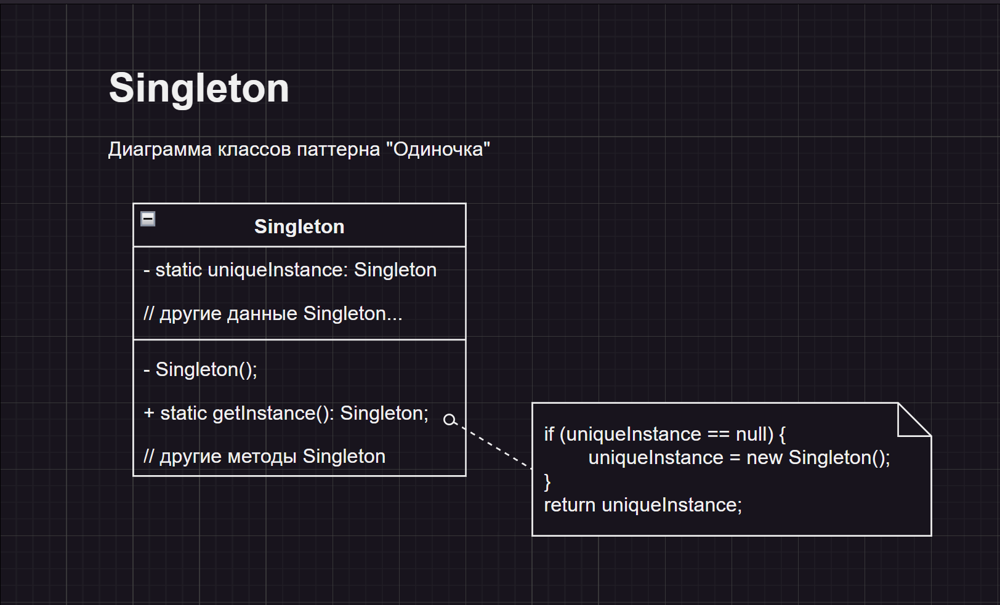

# Архитектура ПО
## Домашняя работа 2
* **
### Автор:
Деревянных Алексей
* **
### Примечание:

Исходники в папке **/src/**

### Условие задачи:

1. Разработать UML-диаграмму для демонстрации работы шаблона проектирования Singleton, Builder, Adapter, Facade, Decorator, Proxy, Observer, Mediator ИЛИ ЛЮБОГО ДРУГОГО НА ВАШ ВЫБОР (как мы это делали на семинаре).
2. ** Продемонстрировать работу этого шаблона проектирования в вашей программе (как мы это делали на семинаре).

### Описание паттерна "Singleton"

Паттерн "Одиночка" (Singleton) относится к **порождающим** паттернам. Он гарантирует, что у класса есть только один экземпляр, и предоставляет к нему глобальную точку доступа. Часто используется для управления пулами ресурсов - скажем, подключений или программных потоков.

### Диаграмма классов паттерна "Singleton":

