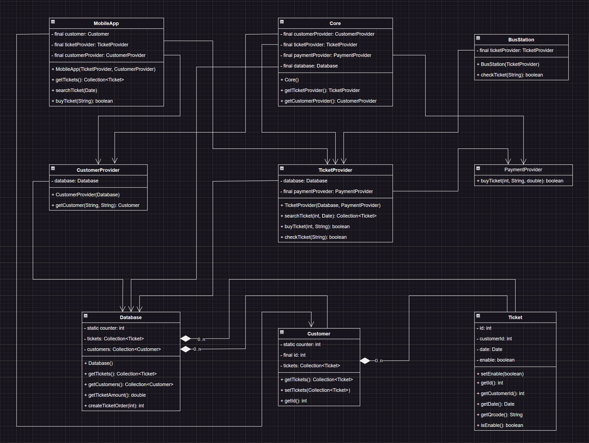

# Архитектура ПО
## Домашняя работа 4
* **
### Автор:
Деревянных Алексей
* **
### Примечание:

Исходники в папке **/src/**

### Условие задачи:

1. Переработать один из модулей (на выбор TicketProvider, CustomerProvider) в рамках комплекса "Покупка онлайн билетов на автобус в час пик" с точки зрения контрактного программирования.

2. Разработать Диаграмму компонент комплекса использую нотацию UML 2.0. Общая без деталей.

Думаю, достаточно выполнить одну любую задачу на выбор.

### Диаграмма классов комплекса "Покупка онлайн билетов на автобус в час пик":

